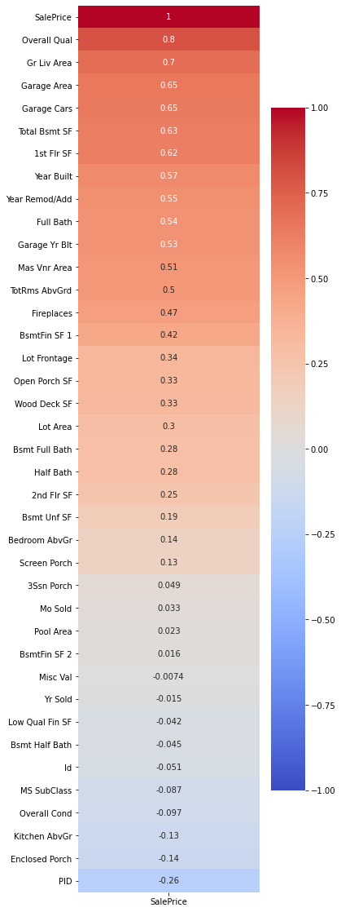
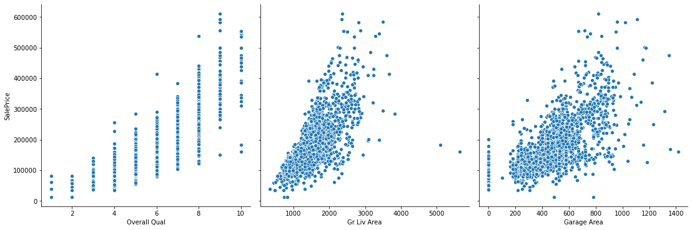

# Ames, IA House Sale Price Estimation

### Problem Statement

Home Flippers, LLC, a company focused on flipping homes in the Ames, IA region, contracted me to build a model to identify predicted home values in the area. They were looking to use this model so they could calculate predicted prices for houses on the market in relation to historical sale prices of comparable houses. This information is of concern and value to them to enable them to identify opportunities with the greatest upside after making renovations or remodeling the house for sale. 

Obviously the majority of the upside in sale price from a home flip comes from the improvements made during the renovations, but by identifying undervalued homes in need of repair would allow them to calculate the potential upside compared to the amount of investment they put into the renovation.

___
### Summary

Things to look into in this report:
- Which house features have the greatest influence on house sale price?
- How accurate can I get a model to accurately predict house prices based on an existing dataset?
- Which houses present the biggest upside opportunity for someone intending to renovate and flip a house?
- Generate a list of houses of various sizes which sold for the least and meet the previous condition.

___
### Data Dictionary

*Original Data Documentation located [here](http://jse.amstat.org/v19n3/decock/DataDocumentation.txt).*

#### Columns (features) used in my final model:

|Feature|Type|Dataset|Description|
|---|---|---|---|
|**Id**|*int*|Ames, Iowa Housing Dataset|Unique identifier representing each data point|
|**ms_zoning**|*object*|Ames, Iowa Housing Dataset|General zoning classification of the sale|
|**street**|*object*|Ames, Iowa Housing Dataset|Type of road access to property|
|**neighborhood**|*object*|Ames, Iowa Housing Dataset|Physical location within Ames city limits|
|**cond_1**|*object*|Ames, Iowa Housing Dataset|Proximity to various conditions|
|**bldg_type**|*object*|Ames, Iowa Housing Dataset|Type of dwelling|
|**style**|*object*|Ames, Iowa Housing Dataset|Style of dwelling|
|**overall_qual**|*int*|Ames, Iowa Housing Dataset|Rating of the overall material and finish of the house|
|**overall_cond**|*int*|Ames, Iowa Housing Dataset|Rating of the overall condition of the house|
|**yr_built**|*int*|Ames, Iowa Housing Dataset|Original construction date|
|**yr_remodeled**|*int*|Ames, Iowa Housing Dataset|Remodel date (same as built date if no remodeling or additions)|
|**roof_style**|*object*|Ames, Iowa Housing Dataset|Type of roof|
|**exter_1**|*object*|Ames, Iowa Housing Dataset|Exterior covering on the house|
|**exter_cond**|*object*|Ames, Iowa Housing Dataset|Evaluates the present condition of the material on the exterior|
|**foundation**|*object*|Ames, Iowa Housing Dataset|Type of foundation|
|**bsmt_qual**|*object*|Ames, Iowa Housing Dataset|Evaluates the height of the basement|
|**bsmt_cond**|*object*|Ames, Iowa Housing Dataset|Evaluates the general condition of the basement|
|**bsmt_expo**|*object*|Ames, Iowa Housing Dataset|Refers to walkout or garden level walls for the basement|
|**bsmt_fin_1**|*object*|Ames, Iowa Housing Dataset|Rating of basement finished area|
|**cent_air**|*object*|Ames, Iowa Housing Dataset|Central air conditioning|
|**full_bath**|*int*|Ames, Iowa Housing Dataset|Full bathrooms above grade|
|**half_bath**|*int*|Ames, Iowa Housing Dataset|Half baths above grade|
|**kitch_qual**|*object*|Ames, Iowa Housing Dataset|Kitchen quality|
|**tot_rooms_gr**|*int*|Ames, Iowa Housing Dataset|Total rooms above grade (not including bathrooms)|
|**fireplaces**|*int*|Ames, Iowa Housing Dataset|Number of fireplaces|
|**garage_type**|*object*|Ames, Iowa Housing Dataset|Garage location/type|
|**garage_car_size**|*int*|Ames, Iowa Housing Dataset|Size of garage in car capacity|
|**garage_cond**|*object*|Ames, Iowa Housing Dataset|Garage condition|
|**paved_drive**|*object*|Ames, Iowa Housing Dataset|Paved driveway|
|**gar_car_size_overall_qual**|*int*|Interaction term|[Size of garage in car capacity] * [Overall quality of the material and finish of the house, converted to numbers]|
|**full_bath_gr_liv_area_log**|*float*|Interaction term / log|Log of [Full baths above grade] * [Living area above grade]|
|**bsmt_fin_1_sf_scaled_mm_log**|*float*|MinMax scaled / log|Log of [Square footage of the finished basement MinMax scaled to (1, 2)]|
|**bsmt_fin_2_sf_scaled_mm_log**|*float*|MinMax scaled / log|Log of [Square footage of the second category finished basement MinMax scaled to (1, 2)]|
|**bsmt_sf_scaled_mm_log**|*float*|MinMax scaled / log|Log of [Total square footage of the basement MinMax scaled to (1, 2)]|
|**bedrooms_gr_shift_log**|*float*|Linear shifted / log|Log of [Bedrooms above grade with a linear shift]|
|**tot_rooms_gr_gr_liv_area_log**|*float*|Interaction term / log|Log of [Total rooms above grade] * [Living area above grade]|
|**lot_area_log**|*float*|Log|Log of the total lot area|
|**gr_liv_area_log**|*float*|Log|Log of the living area above grade|
|**bsmt_baths**|*float*|Interaction term|Total number of bathrooms in the basement (Full bathrooms + Half bathrooms/2)|
|**functional**|*object*|Ames, Iowa Housing Dataset|Home functionality (any deductions to house functionality)|
|**functional_mapped_overall_qual**|*int*|Interaction term|[Home functionality with mapped values for Salvaged and Severely Damaged] * [Overall quality]|
|**sale_price**|*int*|Ames, Iowa Housing Dataset|Sale price of the homes in the training dataset|

___
### Data Discovery

- My initial dive into the data began by reading through the data documentation and considering which features I thought might have the greatest influence, positive or negative, on sale price.
- Next, I created a list of the categorical variables I was investigating and counted their values to determine what changes I would have to make to the data during the cleaning and mapping process.
- I then produced a heatmap to show those features and their correlations to the sale price.

- After reviewing the heatmap, I produced a pairplot of the top three correlated features to investigate their relation to sale price.
- One thing I took notice of was the outliers present in Living Area Above Grade and how they didn't follow the upward trend of price correlation.

 
- One thing to mention about this project was that it was highly iterative. The steps I took above, especially evaluating value counts for categorical (and sometimes numeric) columns were repeated on new features throughout the refinement process.

___
### Conclusions and Recommendations

As a result of my preliminary analysis of the data and separation of the first quartile schools and districts based on SAT:ACT test taker ratio, I recommend that the College Board target certain schools and districts. These schools/districts are a combination of the lowest SAT:ACT test taker ration and the number of students enrolled.

The top five schools I'd recommend the College Board to target:

1. San Clemente High **
2. Dougherty Valley High
3. Arnold O. Beckman High
4. Los Alamitos High
5. Aliso Niguel High **
*** Represents schools in the top five recommended districts*

|School Name|District Name|12th Graders Enrolled|SAT to ACT Ratio|
|---|---|---|---|
|San Clemente High|Capistrano Unified|808|0.754839|
|Dougherty Valley High|San Ramon Valley Unified|766|0.918367|
|Arnold O. Beckman High|Tustin Unified|760|1.146667|
|Los Alamitos High|Los Alamitos Unified|758|1.217557|
|Aliso Niguel High|Capistrano Unified|749|0.821678|

The top five districts I'd recommend the College Board to target:

1. Capistrano Unified
2. Fontant Unified
3. Poway Unified
4. Fremont Union High
5. Salinas Union High

|District Name|12th Graders Enrolled|SAT to ACT Ratio|
|---|---|---|
|Capistrano Unified|4805|0.915464|
|Fontana Unified|2941|0.389149|
|Poway Unified|2918|1.171095|
|Fremont Union High|2761|1.006881|
|Salinas Union High|2683|1.405039|

If the College Board focuses on these schools and districts their budget will be best implemented as these schools/districts are taking the SAT proportionately less than the state average. These schools/districts also have the the largest populations based on the first quartile of states with a low SAT:ACT ratio, providing the greatest upside for the College Board.

___

### What Next

Things I would like to look into as the project continues:
- Which districts have the highest number of students applying to colleges?
- Do the findings about which districts have the lowest SAT:ACT ratio extend to their counties, or do the districts operate more independently?
- Do high schools that are geographically closer to major colleges or or universities which don't require the SAT or ACT have lower test participation rates?
___